# Azure Starter for Windows Virtual Desktop
Azure Starter for WVD is a self-service portal to let users start and deallocate there own personal VDI's running in Windows Virtual Desktop.

Users can easily log on to the web app using their Azure AD credentials. The personal assigned VDI's are listed can be switched on or off. Switching off deallocates the VDI in Azure to avoid unnecessary costs.

### Roadmap

- [x] Preview
- [x] Review preview and make some improvements
- [x] Automatically deallocate unused VDIs / session hosts
- [x] Allow some customization

### Screenshot

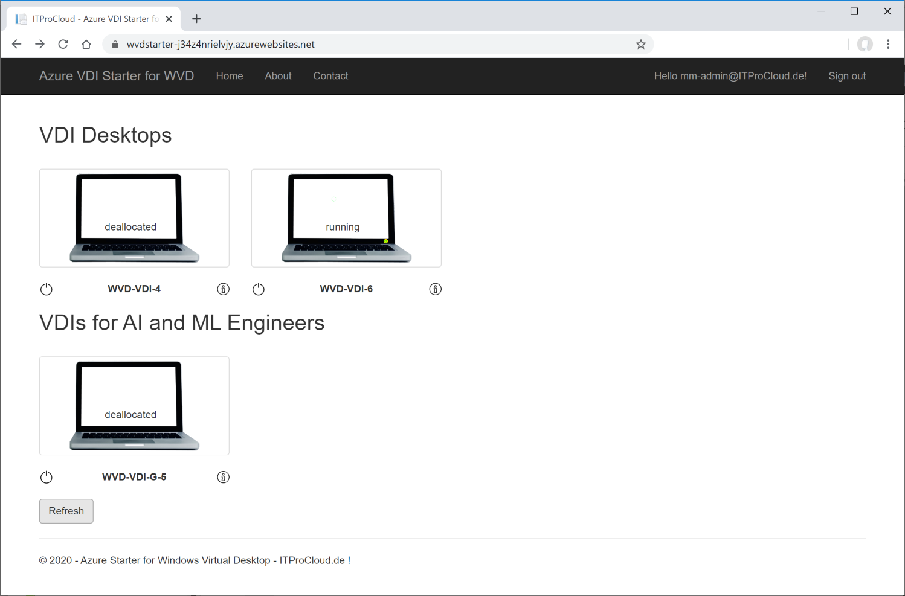


### Assigned VDIs / session hosts

An administrator can assign a user to a VDI / session host with PowerShell or with [#WVDAdmin](https://blog.itprocloud.de/Windows-Virtual-Desktop-Admin/) - or, a user has been assigned automatically after the first login to a session host. 
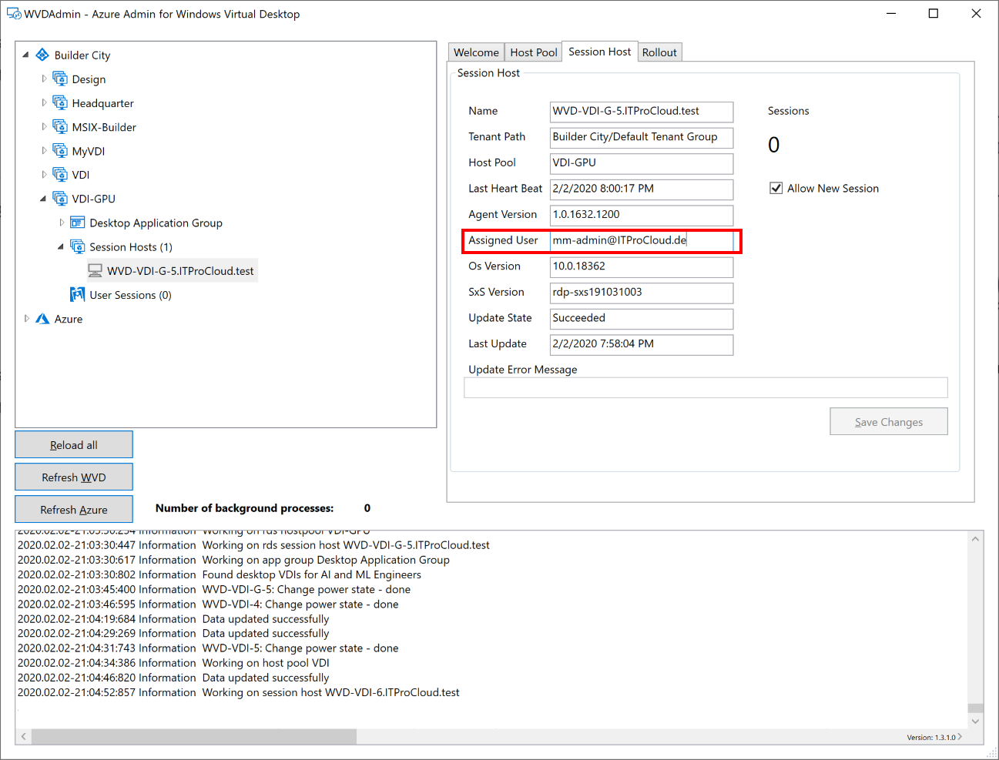


Azure Starter for WVD is a web app to be deployed in the customer's subscription and tenant. To rollout, the solution clicks **Deploy to Azure**. After rolling out the solution, an Azure service principal has to be created to allow logon to the web app and to start/deallocate the VMs / session hosts. The service principal manages the VMs / session hosts - the users don't need access to the Azure portal.


### Rollout the solution by clicking deploy to Azure
<a href="https://portal.azure.com/#create/Microsoft.Template/uri/https%3A%2F%2Fraw.githubusercontent.com%2FMarcelMeurer%2FAzure-Starter-for-WVD%2Fmaster%2Fdeploy%2FmainTemplate.json" target="_blank"></a>

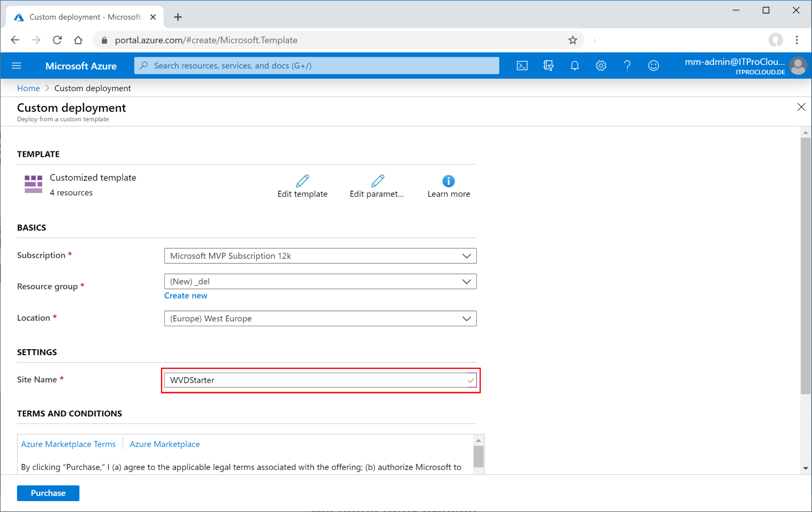

After the deployment open the created web app and copy the generated URL to configure your service principal.

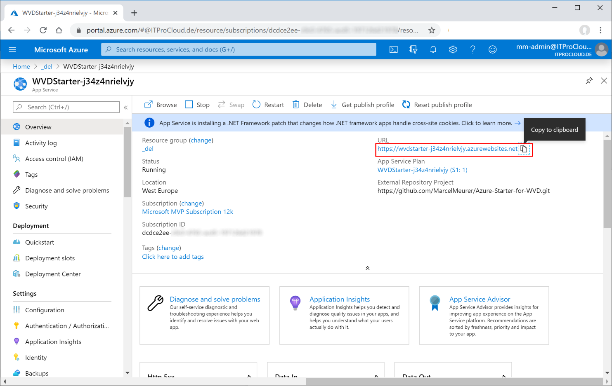


### Create a service principal

To work with the portal you need a service principal (function account) with the permission to start and deallocate session hosts in your WVD tenant or tenants.

To create a service principal go to your Azure Ad -> App registration -> New registration and type a name for your principal like “ svc_WVDStarter” and press “register”.

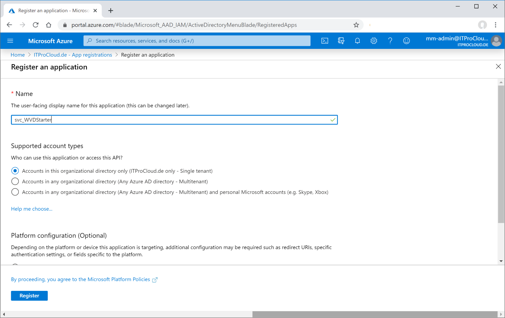

Click on "Authentication" and the platform "Web".


Enter the redirect URI. The redirect URI is the generated URL from above appended with "/.auth/login/aad/callback". E.g.: *https://wvdstarter-j34z4nrielvjy.azurewebsites.net/.auth/login/aad/callback*

Additionally, select "ID Tokens".

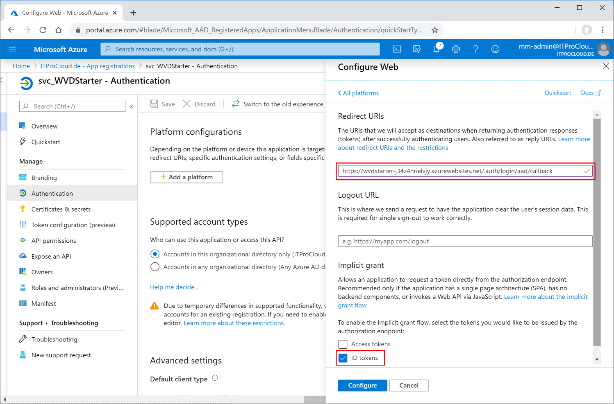

Click on “certificates & secrets”. Click “new client secret”, select a validity period and a description (like “Key01”). Press “add”.

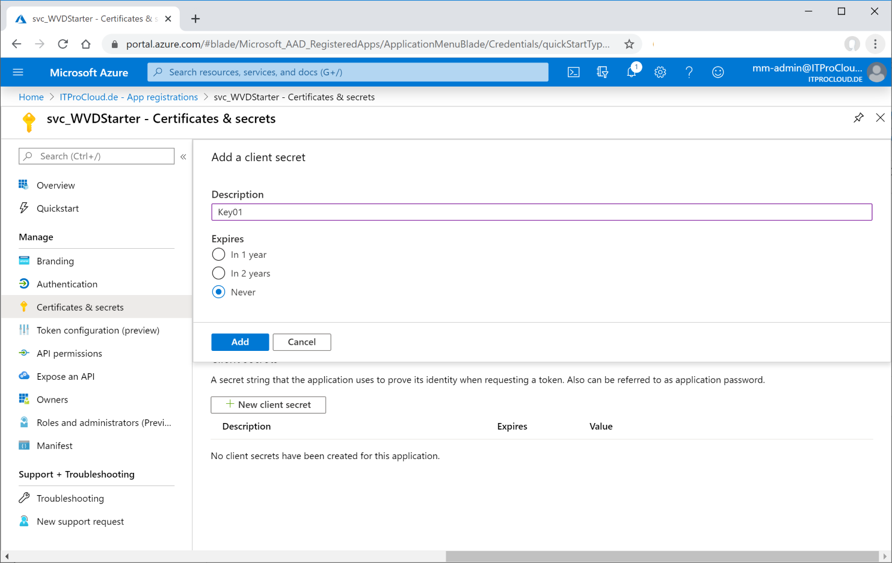

Copy the generated key directly - it will never be displayed again. Note the key for later.

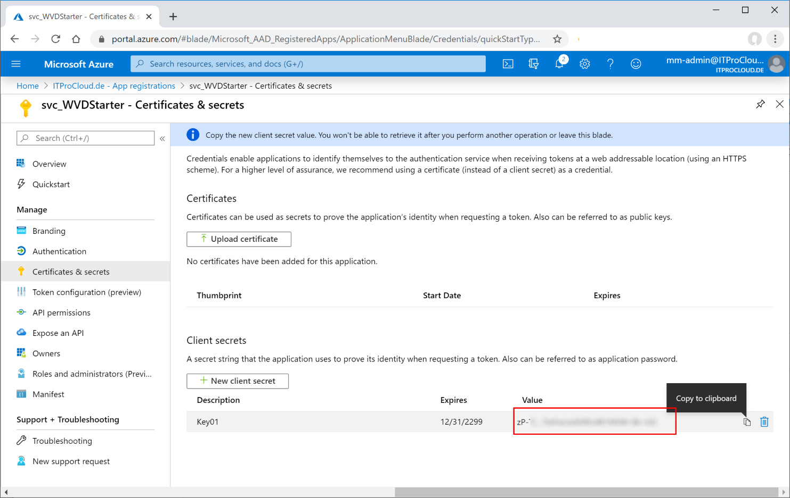

Go to “Overview”. Note the “Application (client) ID” and the “Directory (tenant) ID” as well.

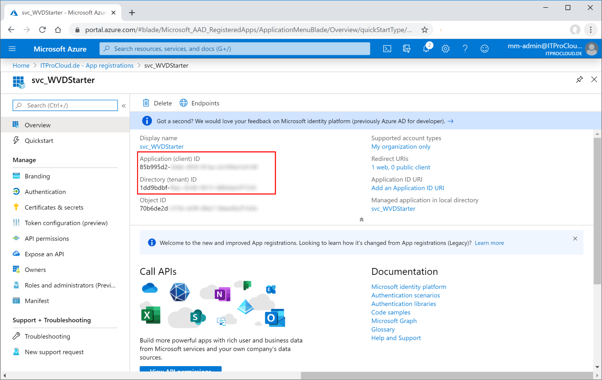

You have to use PowerShell to give the service principal the appropriated permission to access the WVD tenant(s).

```powershell
Import-Module -Name Microsoft.RDInfra.RDPowerShell 
# log on with an administrative user account to your  
Add-RdsAccount -DeploymentUrl "https://rdbroker.wvd.microsoft.com"   

# give your service principal the right permission 
New-RdsRoleAssignment -TenantName "Builder City" -RoleDefinitionName "RDS Reader" -ApplicationId 85b995d2-3xxx-xxxx-xxxx-000000000000
```

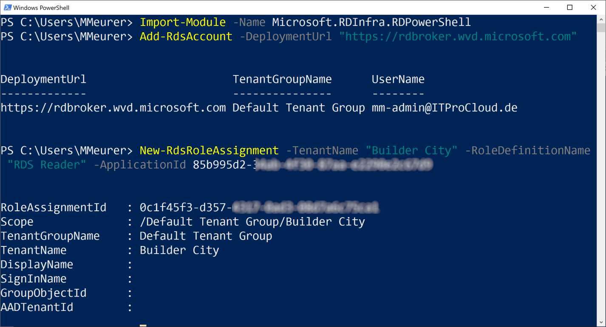

Open the Azure portal and go to the resource groups. Go into each resource group containing your Azure VMs / VDIs / session hosts "Virtual Machine Contributor" (not the classic one), click “Access control (IAM)” -> select “Add” -> Add role assignment. Select “contributor” and search in “select” for your service principal name. Click the principal and save the settings.

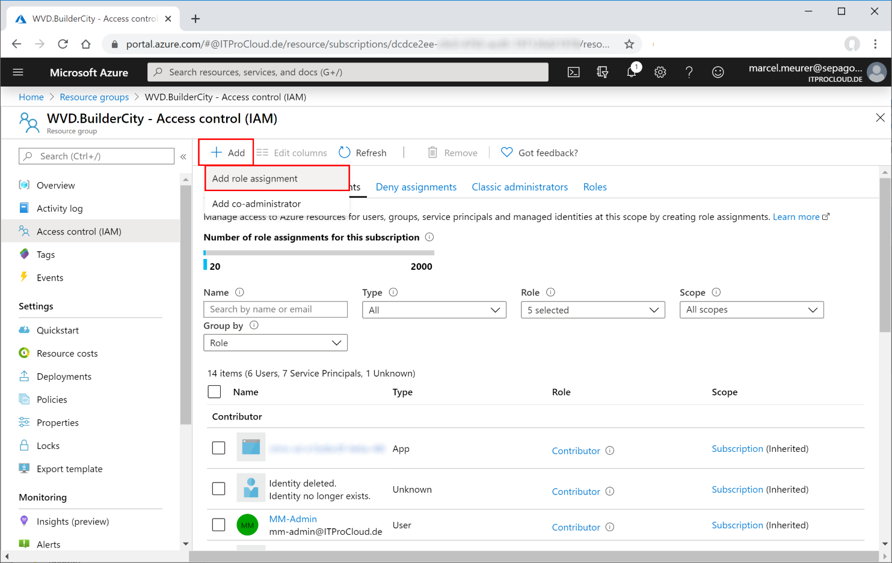

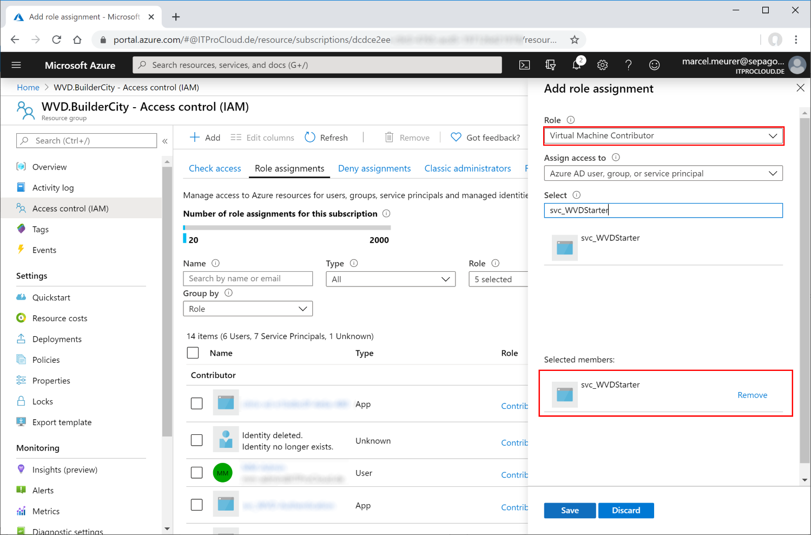

Enter the data from the portal service principal into the portal configuration. Go to the deployed resources and open the web app. Open configuration and change the following values:

- ida:ClientId
- ida:ClientSecret
- ida:TenantId your Azure AD tenant id

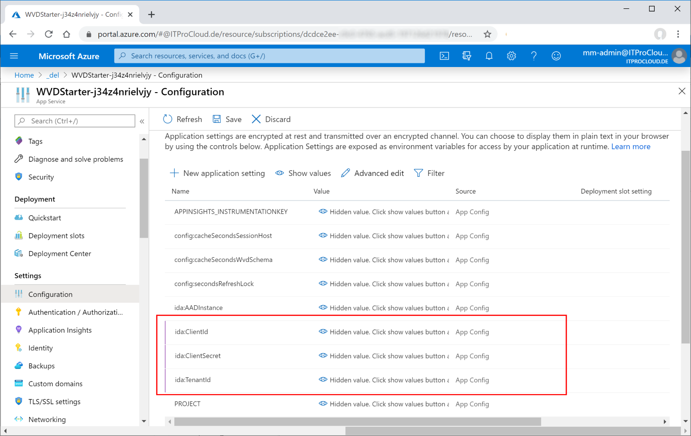

Restart the web app.

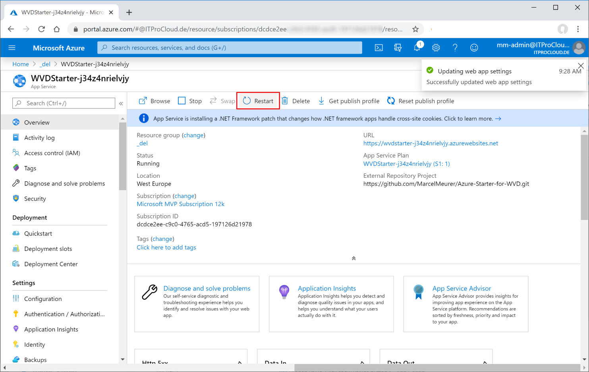

Access the web app and log in with an user account having access to assigned VDIs / session hosts


### Auto-deallocate unused VDIs

The version from 2020.02.09 supports a new feature to deallocate per automatically personal assigned session hosts are not used over a specific time. If you have an older installation, you need to update it.

This feature runs in the background and is independent of users logged on to the web site of WVD Starter. It's monitors session hosts and de-allocates them if there was no session for at least the last n-minutes. 

**Note:** If the engine is still running and a session host / VM has been de-allocated by the engine, don't start this VM from the portal. If no user connects, the VM will still be running.

To use this feature, configure the following settings on the web app running WVD Starter.

- config:autoDeallocateMinutes
  Define the minimum time in minutes after no session is connected to deallocate the session host ;0 to disable.
- config:autoDeallocateHostPools
  A comma-separated string value with the name of the host pools which should be processed. Add  Use the real name (not the friendly name). An empty value handles all persistent host pools.
- config:autoDeallocateCronJobMinutes
  Define the time in minutes in what interval the engine checks the power state and deallocate session hosts.

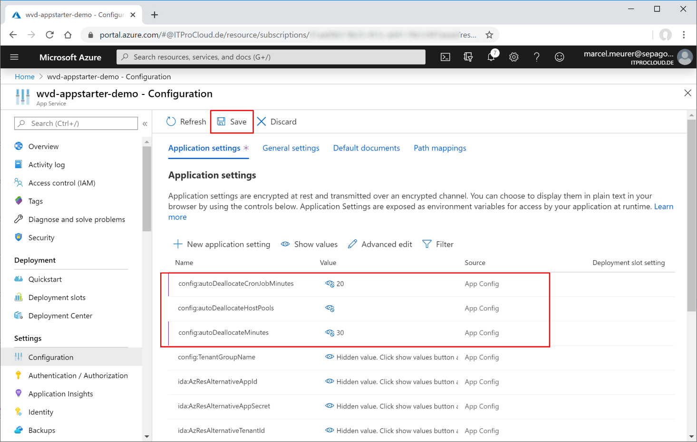

Hints:

- Use group or local policies to log off disconnected sessions after a specific time.
- Use a value for config:autoDeallocateMinutes high enough to allow users to log in after the start of the session host.
- The effective time of deallocating sessions varies because of the different actions, caches, and triggering the cronjob. It can take twice of the configured time of config:autoDeallocateMinutes or config:autoDeallocateCronJobMinutes.
- Don't forget to update the solution.

### Windows Virtual Desktop Spring Update

The version from May the 10th supports the WVD Spring update. To activate the spring update configure the following settings on the web app running WVD Starter.

- config:featureMode
  0=Fall update only, 1=Spring and Fall update, 2=Spring update only

### Update your deployment to the newest version

Azure App Starter for WVD can be updated from GitHub very quickly. Open the web app in the Azure portal, navigate to "Deployment Center" and click "Refresh". This pulls a newer version from the repo to update the app.

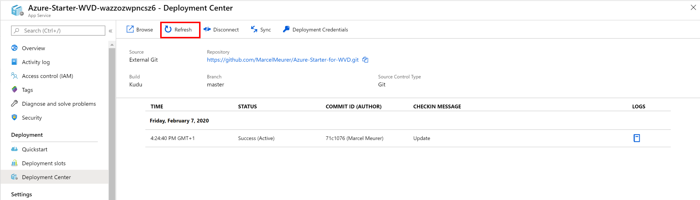


### License

The software is provided "As is", without warranty of any kind, express or implied, including but not limited to the warranties of merchantability, fitness for a particular purpose and noninfringement. In no event shall the authors be liable for any claim, damages or other liability, whether in an action of contract, tort or otherwise, arising from, out of or in connection with the software or the use or other dealings in the software.

This software is free to use as a community edition without support for non-commercial environments. To get a special quote for a supported and commercial version, contact [sales@sepago.de](mailto:sales@sepago.de).

To activate a license code change the settings on the web app running WVD Starter:

- LicenseKey
  Enter the license key provided

### Working with different Azure AD tenants (Microsoft Demo Environment)

Usually, the WVD tenant and the resources (sessions hosts) are in the same AAD tenant. If this not read this document to use Azure Starter for WVD in this environment: <a href="2-Tenant-Environment.md" target="_blank">2-Tenant-Environment.md</a>


### Deploy to Azure

<a href="https://portal.azure.com/#create/Microsoft.Template/uri/https%3A%2F%2Fraw.githubusercontent.com%2FMarcelMeurer%2FAzure-Starter-for-WVD%2Fmaster%2Fdeploy%2FmainTemplate.json" target="_blank"></a>


